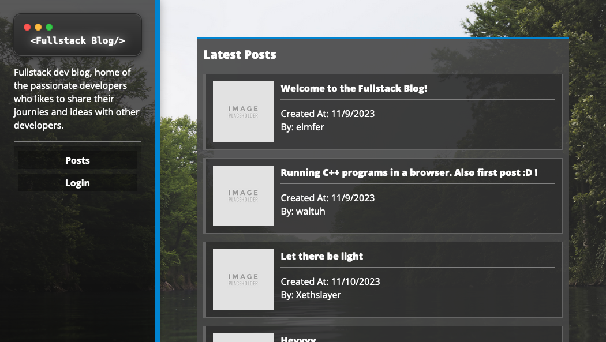

# Fullstack Blog Site

 
 
A fullstack blog where developers can communicate thier journies and ideas about code for other devs to see. All posts, users, and comments are stored in a database and updated dynamically with handlebars.

 View it here: [https://furustaku-burogu-cd0e02ccf391.herokuapp.com](https://furustaku-burogu-cd0e02ccf391.herokuapp.com/)

 ### Screenshot
 
 
## Table Of Contents
1. [Installation](#installation)
2. [Usage](#usage)
3. [License](#license)
4. [Contributing](#contributing)
5. [Tests](#tests)
6. [Questions](#questions)
 
### Installation
 
Ensure you have Node v18.18.0 or greater installed. Then clone the repository. Before you are able to use the application, run `npm install`. To configure the server to connect to the database, create a `.env` file that has `DB_HOST`, `DB_USER`, `DB_PASSWORD`, and `DB_NAME`; this file should be loacted in the root directory of the project.
 
### Usage
 
Like mentioned in the previous section ensure that your enviornment variables for your database connection is set. To run the server, run `npm run start`.
 
### License
 
 

This project in under the MIT license. Learn more about it here: https://opensource.org/licenses/MIT
 
### Contributing
 
Follow the same formatting when writing Javascript. Write plenty of descriptive commits when adding a feature. When making a pull request, ask to merge to the `develop` branch.
 
### Tests
 
No test instructions are available at this time.
 
### Questions
 
What is the link to my GitHub?
 
- Link to my GitHub profile: [https://github.com/elmfer](https://github.com/elmfer)
 
How can you contact me?
 
- Contact me through my email: [elmfer10@gmail.com](mailto:elmfer10@gmail.com)
